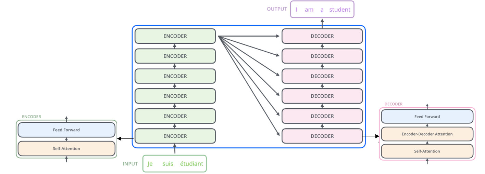
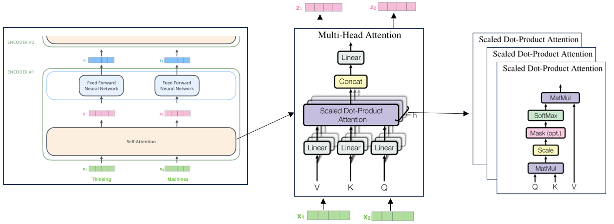
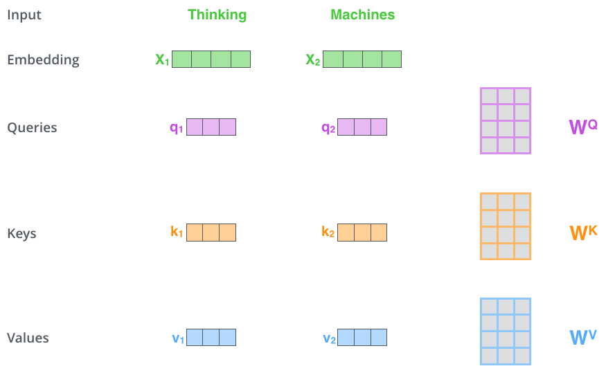
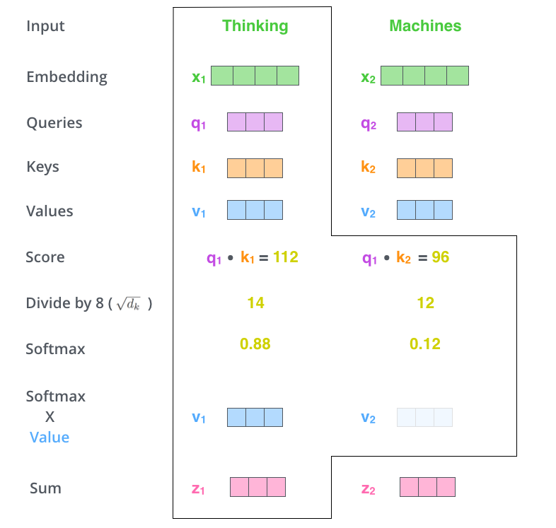
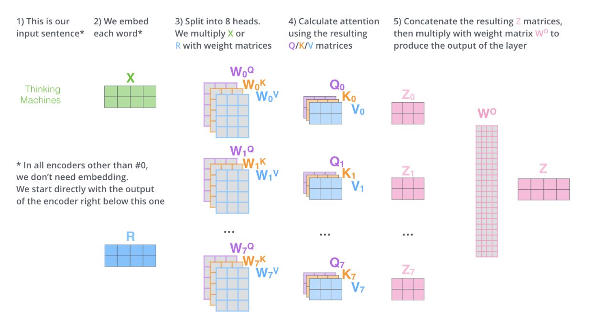
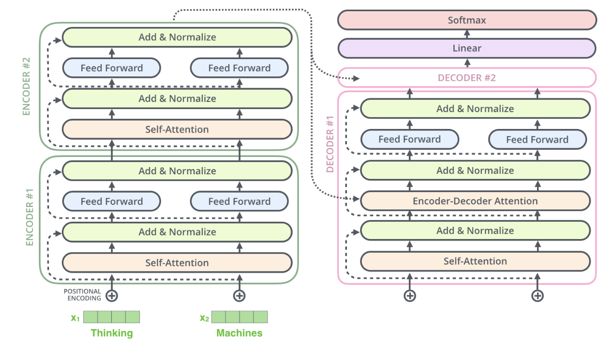

# Transformer原理详解
## Transformer
2017年，Google在论文Attention Is All You Need中提出Transformer，解决了传统Seq2Seq模型在处理可变长序列时遇到的问题。

### 动机
传统的循环神经网络RNN和卷积神经网络CNN在处理长序列时均存在限制。RNN在反向传播时，由于参数共享和多次连乘的特性，容易出现梯度消失/爆炸的问题，进而导致其在处理长序列时难以捕捉长距离依赖关系，只能利用较短的上下文信息。CNN通过卷积核进行局部感知，虽然可以通过增加层数和使用更大的卷积核扩展感受野，但仍倾向于局部特征提取，难以获取全局上下文信息。Transformer通过自注意力机制self-attention解决了这个问题。

### 先验知识
- **Seq2Seq**： Seq2Seq（Sequence-to-Sequence）模型通常包含编码器Encoder和解码器Decoder两部分，这两个部分都可以由不同网络结构来实现，比如CNN和RNN。
- **RNN**：RNN（Recurrent Neural Network）循环神经网络适用于处理具有序列性质的数据，如语音识别等。RNN有one to one，one to many，many to one，many to many等多种结构，以序列数据作为输入，通过网络内部结构设计挖掘捕捉数据中的时序信息以及语义信息。
- **CNN**：CNN（Convolutional Neural Network）卷积神经网络适用于处理图像数据，其结构由卷积层、池化层和全连接层组成。卷积层用于提取输入数据中的局部特征，之后池化层对卷积层的输出进行下采样，保留局部最显著的特征进而减少计算量，然后全连接层对提取的特征进行进一步处理和分类，产生最终分类结果和特征表示。

## Transformer架构

如图所示，左侧为编码器，右侧为解码器。编码器接收向量列表作为输入，通过将向量传递到self-attention层，然后传递到前馈神经网络层Feed Forward来处理此类别，之后将输出向上发送到下一个Encoder。解码器比编码器多了一层Encoder-Decoder Attention，帮助解码器关注输入句子的相关部分。

### Self-Attention模块

- Query：想要从文本中提取的特征
- Key：文本中每个词语的表示，用于帮助计算Query与其他词语之间的关联程度
- Value：每个词语的具体含义或特征向量

#### Q、K、V的计算

q1  = X1 * WQ, k1 = X1 * WK, v1 = X1 * WV

q2  = X2 * WQ, k2 = X2 * WK, v2 = X2 * WV

采用该方式得到每个向量的Q、K、V
（在训练过程中，WQ、WK和 WV是随机初始化的矩阵）

#### 权重计算

当计算一个单词与其它单词之间关系时，用该单词的Q去请求其他单词的K，得到一个分数，将分数归一化，与每个单词的V做线性加权和得到该单词的self-attention的输出。

### Muti-Head Attention

多头注意力机制拥有8组Q/K/V权重矩阵，每组权重矩阵都经过随机初始化。经过相同的self-attention计算，会得到8个不同的Z矩阵，之后将8个矩阵连接起来，乘以额外的一个权重矩阵WO得到最终的Z。

### 其他模块

- Feed Forward：Feed Forward在Transformer中通常由两个全连接层组成，中间夹着一个非线性激活函数（如ReLU），由于在self-attention内部结构中，进行的都是矩阵乘法即线性变换，而线性变换的学习能力不如非线性变换强，因此通过Feed Forward层的激活函数来增强单词表达能力。
- Residual Connection： X1经过层层处理后的输出并不作为最终输出，而是要再加一次进行网络的跳连，该操作是为了解决梯度消失的问题（可以参考Resnet的实现）；
- LayerNorm：归一化层，调整数据的分布，有助于训练的收敛；

# 参考链接
* https://jalammar.github.io/illustrated-transformer/
* https://zhuanlan.zhihu.com/p/338817680
* https://www.zhihu.com/people/shi-xing-deng-yi

